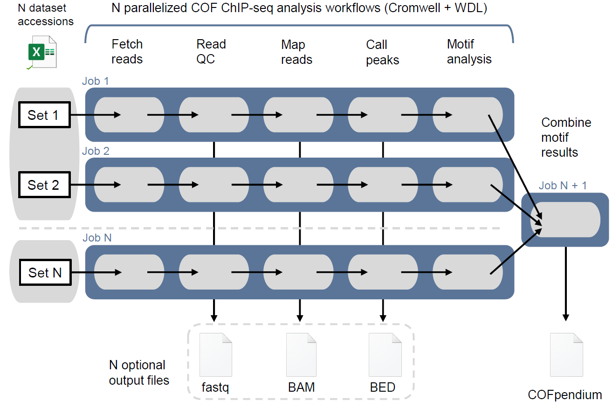

# COFpendium
A compendium of COF-TF interactions inferred from genome-wide motif analysis of publicly available COF ChIP-seq data

## Overview
There currently exists no centralized resource to explore which transcription factors (TFs) recruit transcriptional cofactor (COFs) in genome-wide data. As important mediators of chromatin modification and remodelling, understanding how these COF-TF complexes are recruited to DNA in a cell- and context-specific manner is fundamental to our understanding of gene regulation as a whole. To address this, I developed the COFpendium as a compendium of motif analysis results from uniformly re-processed publicly available COF ChIP-seq datasets. The sets of TF models found underlying COF peaks in a given experiment can be compared across conditions to explore experiment-specific or shared inferred COF-TF complexes. The meta-analysis pipeline is implemented as a workflow using WDL and parallelized/executed using the Broad Institute's Cromwell engine.

Each of the N input datasets listed in the accessions file is fetched from NCBI and remapped to the reference genome. Areas of locally enriched mapped reads ("peaks") are then called and TF binding models found enriched near the summits of these COF peaks are determined. The final step of the COFpendium workflow indexes the motif analysis results by dataset accession and created a single table by concatenating the results together to generate a single resource.

## File descriptions
The following are short descriptions of each of the files included in this repository. For more information on how each is used, check out the sections that follow.
|Name |Description |
|-----|------------|
| COFpendium_metadata.tsv | text file that contains the dataset SRA accession numbers and describes metadata for each experiment |
| COFpendium_qsub.conf | the configuration file used by Cromwell to execute the parallelized workflow on the Boston University Shared Computing Cluster (SCC) |
| COFpendium_run.wdl | the workflow (WDL) that contains all of the commands to perform the parallelized ChIP-seq meta-analyses |
| run_COFpendium_cromwell.sh | shell script that loads modules used by the workflow and executes the actual analysis by invoking Cromwell |

## Usage
To reconstitute the COFpendium on the Boston University SCC, clone this repository. From inside the cloned directory, run the following command:  
`qsub -P [projectName] run_COFpendium_cromwell.sh`  
The shell script will load all of the modules needed and execute the COFpendium WDL using the Cromwell engine. Running the shell script submits N parallel jobs (one for each file described in the metadata tsv) that are monitored by Cromwell. Once these have completed, the motif analysis results are concatenated in a final step which produces the full COFpendium.
